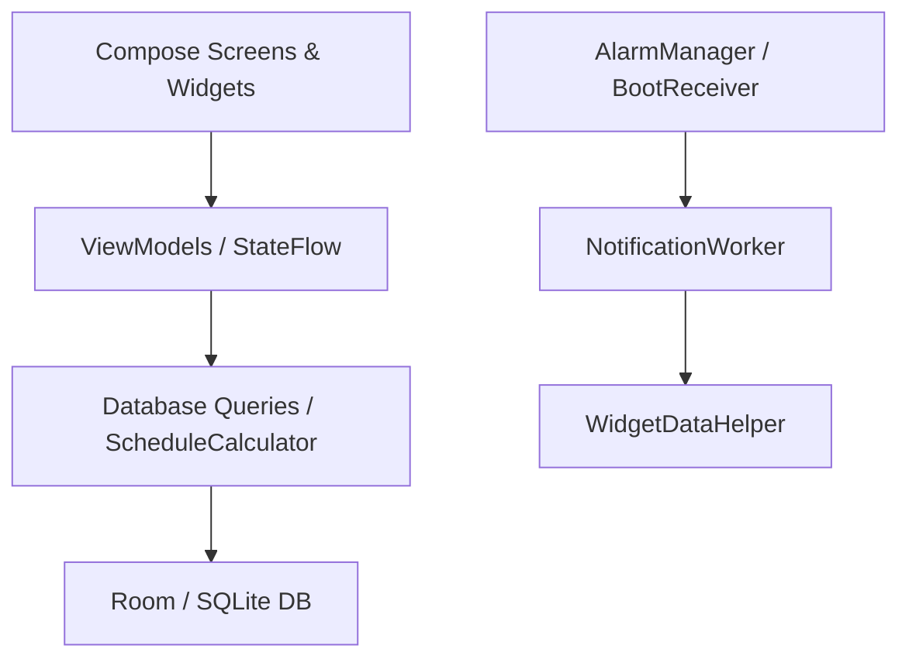

# 📅 ShiftPlanner

En schemaapp utvecklad i **Kotlin** med **Jetpack Compose** för Android.

ShiftPlanner är gjord för skiftarbetare och hjälper till att hålla ordning på **rullande scheman, övertid, inhopp, passbyten, kollegors arbetstider och notis påminnelser**.

---

## 📑 Innehåll

* [Projektstruktur](#-projektstruktur)
* [Mappstruktur](#-mappstruktur)
* [Kom igång](#-kom-igång)
* [Skärmbilder](#️-skärmbilder)
* [Funktioner](#-funktioner)
* [Arkitektur](#️-arkitektur)
* [Avancerade Kotlin/Android-koncept](#-avancerade-kotlinandroid-koncept)
* [Katalog över viktiga filer](#-katalog-över-viktiga-filer)
* [License](#-license)
* [AI-assistans och kodgenerering](#-ai-assistans-och-kodgenerering)

---

## 📁 Projektstruktur

Projektet är organiserat enligt Android-standarder med **MVVM-arkitektur** och fokus på *Separation of Concerns*.

| Projektstruktur | Namn                | Beskrivning                                             |
| :-------------- | :------------------ | :------------------------------------------------------ |
| `ShiftPlanner`  | Gradle Root         | Projektets huvudnivå.                                   |
| `app`           | Android Application | Innehåller UI, ViewModels, databaser, widgets och larm. |

---

## 🧱 Mappstruktur

Kärnlogiken för appen finns under:

```text
app/src/main/java/com/example/shiftplanner/
├── alarm/                  # AlarmManager, BroadcastReceivers & NotificationWorker
├── data/
│   └── db/                 # Room: Entities, DAO & AppDatabase
├── model/                  # Datamodeller och skift-typer
├── ui/
│   ├── screens/            # Compose-skärmar
│   └── theme/              # Material 3: Color, Type & Theme
├── utils/                  # Hjälpklasser för beräkningar och UI-logik
└── widget/                 # Jetpack Glance / App Widget-implementation
```

---

## 🚀 Kom igång

### Förutsättningar

* Android Studio
* Kotlin
* Gradle
* Android SDK
* En Android-enhet eller emulator

### Build & Run

1. Klona repot:

```bash
git clone <REPOSITORY_URL>
```

2. Öppna projektet i **Android Studio**.

3. Synkronisera Gradle-filerna.

4. Välj en Android-enhet eller emulator.

5. Kör projektet med:

```bash
./gradlew assembleDebug
```

eller starta appen direkt från Android Studio.

> **Obs:** Ersätt `<REPOSITORY_URL>` med den faktiska URL:en till GitHub-repositoriet.

---

### 🎬 Demo
<div align="center">
  <video src="https://github.com/user-attachments/assets/6e0548da-7d18-4f0c-bce7-15d08b335a82" autoplay loop muted playsinline width="250"></video>
</div>

---

## 🖼️ Skärmbilder
Här är några översikter från appens gränssnitt:

| &nbsp;&nbsp;&nbsp;&nbsp;&nbsp;&nbsp;&nbsp;&nbsp;Startskärm (Idag)&nbsp;&nbsp;&nbsp;&nbsp;&nbsp;&nbsp;&nbsp;&nbsp; | &nbsp;&nbsp;&nbsp;&nbsp;&nbsp;&nbsp;&nbsp;&nbsp;&nbsp;&nbsp;&nbsp;&nbsp;&nbsp;Månadsvy&nbsp;&nbsp;&nbsp;&nbsp;&nbsp;&nbsp;&nbsp;&nbsp;&nbsp;&nbsp;&nbsp;&nbsp;&nbsp; | &nbsp;&nbsp;&nbsp;&nbsp;&nbsp;&nbsp;&nbsp;&nbsp;&nbsp;&nbsp;Hantera Pass&nbsp;&nbsp;&nbsp;&nbsp;&nbsp;&nbsp;&nbsp;&nbsp;&nbsp;&nbsp; |
| :---: | :---: | :---: |
|  |  |  |
| *Dagens pass och<br>kollegors tider* | *Smidig månadskalender<br>med Pager* | *Hantera inhopp och<br>passbyten* |

| &nbsp;&nbsp;&nbsp;&nbsp;&nbsp;&nbsp;&nbsp;&nbsp;&nbsp;Schemat översikt&nbsp;&nbsp;&nbsp;&nbsp;&nbsp;&nbsp;&nbsp;&nbsp;&nbsp; | &nbsp;&nbsp;&nbsp;&nbsp;&nbsp;&nbsp;&nbsp;&nbsp;&nbsp;&nbsp;&nbsp;&nbsp;&nbsp;&nbsp;&nbsp;Statistik&nbsp;&nbsp;&nbsp;&nbsp;&nbsp;&nbsp;&nbsp;&nbsp;&nbsp;&nbsp;&nbsp;&nbsp;&nbsp;&nbsp;&nbsp; | &nbsp;&nbsp;&nbsp;&nbsp;&nbsp;&nbsp;&nbsp;&nbsp;Hemskärmswidget&nbsp;&nbsp;&nbsp;&nbsp;&nbsp;&nbsp;&nbsp;&nbsp; |
| :---: | :---: | :---: |
|  |  |  |
| *Rullande<br>6-veckorsschema* | *Översikt &<br>sökning* | *Hemskärmswidget<br>(Jetpack Glance)* |
---

## ✨ Funktioner

| Funktion                      | Beskrivning                                                                                            |
|:------------------------------|:-------------------------------------------------------------------------------------------------------|
| **Idag**                   | Visar dagens pass, tider, vilka kollegor som arbetar samt snabbval för att hantera dagen.              |
| **Månadsvy**              | Smidig sidbläddring mellan månader, klickbar års- och månadsväljare samt gråtoning av passerade dagar. |
| **Inhopp & passbyten**     | Hantering av övertid och passbyten med spärrar som förhindrar dubbelbokningar.                         |
| **Hemskärmswidget**        | Genomskinlig och klickbar widget som visar veckoschemat och dagens pass direkt på startskärmen.        |
| **kvällspåminnelser**       | Skräddarsydda notiser via WorkManager som påminner kvällen innan arbetspass.                           |
| **Omstartsskydd**          | `BootReceiver` ser till att larm schemaläggs om efter en omstart av enheten.                           |
| **Personlig touch**        | Färgkodade pass och en överskådlig struktur för hela arbetslaget.                                      |

---

## 🏗️ Arkitektur

ShiftPlanner använder en **MVVM-baserad arkitektur** där UI, state, datalager och bakgrundsarbete hålls separerade.



### Arkitekturflöde

```text
Compose UI
    ↓
ViewModel / StateFlow
    ↓
Repository / ScheduleCalculator
    ↓
Room Database
    ↓
SQLite
```

Bakgrundsnotiser hanteras separat:

```text
AlarmManager / BootReceiver
    ↓
NotificationWorker
    ↓
Notification
    ↓
WidgetDataHelper
```

---

## 🧠 Kotlin/Android-koncept

| Område                           | Exempel i koden                          | Förklaring                                                                                                     |
| :------------------------------- | :--------------------------------------- | :------------------------------------------------------------------------------------------------------------- |
| **Kotlin Flows & Coroutines**    | `Flow`, `StateFlow`, `collectAsState`    | Reaktivt dataflöde mellan den lokala Room-databasen och UI-lagret.                                             |
| **Bakgrundstjänster**            | `BroadcastReceiver`, `CoroutineWorker`   | Hanterar enhetsomstarter (`BOOT_COMPLETED`) och schemaläggning av bakgrundsarbete.                             |
| **Exakta larm**                  | `AlarmManager.setExactAndAllowWhileIdle` | Säkerställer att kvällspåminnelser triggas så exakt som möjligt även när enheten befinner sig i strömsparläge. |
| **Room Database**                | `@Entity`, `@Dao`, Relations / Joins     | Effektiv lokal lagring av kollegor, grundschema och dynamiska övertidsregler.                                  |
| **Jetpack Compose & Material 3** | `Card`, `HorizontalPager`, `FilterChip`  | Modern, responsiv UI-design med anpassade komponenter och pastellfärger.                                       |

---

## 📚 Katalog över viktiga filer

### Databas

* `data/db/AppDatabase.kt`
  Singleton-konfiguration för Room-databasen.

* `data/db/ScheduleDao.kt`
  SQL-frågor och `Flow`-baserade dataflöden för kollegor och scheman.

* `data/db/OvertimeEntry.kt`
  Entitet för övertid, frånvaro och passbyten.

### Larm & notiser

* `alarm/AlarmHelper.kt`
  Logik för att sätta och avbryta larm.

* `alarm/NotificationWorker.kt`
  WorkManager-jobb som utvärderar morgondagens pass och skickar notiser.

* `alarm/BootReceiver.kt`
  Lyssnar efter omstart av enheten och bokar om larmen.

### UI

* `ui/screens/HomeScreen.kt`
  Huvudskärm med dagens pass, veckorad och snabbval.

* `ui/screens/MonthViewScreen.kt`
  Interaktiv månadskalender med Pager och administrationsläge.

---

## 📜 License

Detta projekt distribueras under **MIT License**.

```text
MIT License

Copyright (c) 2026 ShiftPlanner

Permission is hereby granted, free of charge, to any person obtaining a copy
of this software and associated documentation files (the "Software"), to deal
in the Software without restriction, including without limitation the rights
to use, copy, modify, merge, publish, distribute, sublicense, and/or sell
copies of the Software, and to permit persons to whom the Software is
furnished to do so, subject to the following conditions:

The above copyright notice and this permission notice shall be included in all
copies or substantial portions of the Software.

THE SOFTWARE IS PROVIDED "AS IS", WITHOUT WARRANTY OF ANY KIND, EXPRESS OR
IMPLIED, INCLUDING BUT NOT LIMITED TO THE WARRANTIES OF MERCHANTABILITY,
FITNESS FOR A PARTICULAR PURPOSE AND NONINFRINGEMENT. IN NO EVENT SHALL THE
AUTHORS OR COPYRIGHT HOLDERS BE LIABLE FOR ANY CLAIM, DAMAGES OR OTHER
LIABILITY, WHETHER IN AN ACTION OF CONTRACT, TORT OR OTHERWISE, ARISING FROM,
OUT OF OR IN CONNECTION WITH THE SOFTWARE OR THE USE OR OTHER DEALINGS IN THE
SOFTWARE.
```

---

## 🤖 AI-assistans och kodgenerering

Delar av denna kodbas har skapats, refaktorerats eller assisterats med hjälp av stora språkmodeller (**LLM**) och AI-verktyg för att effektivisera utvecklingsprocessen och förbättra kodkvaliteten.

### Verktyg som använts

* **Gemini** – används bland annat för strukturering, felsökning, arkitekturråd och kodoptimering.

### Mänsklig granskning

All AI-genererad kod har **granskats, testats och validerats manuellt** av utvecklaren.

AI-verktyg har fungerat som ett stöd i utvecklingsprocessen, medan den slutliga implementationen, arkitekturen och kvalitetssäkringen har hanterats av utvecklaren.

```
```
