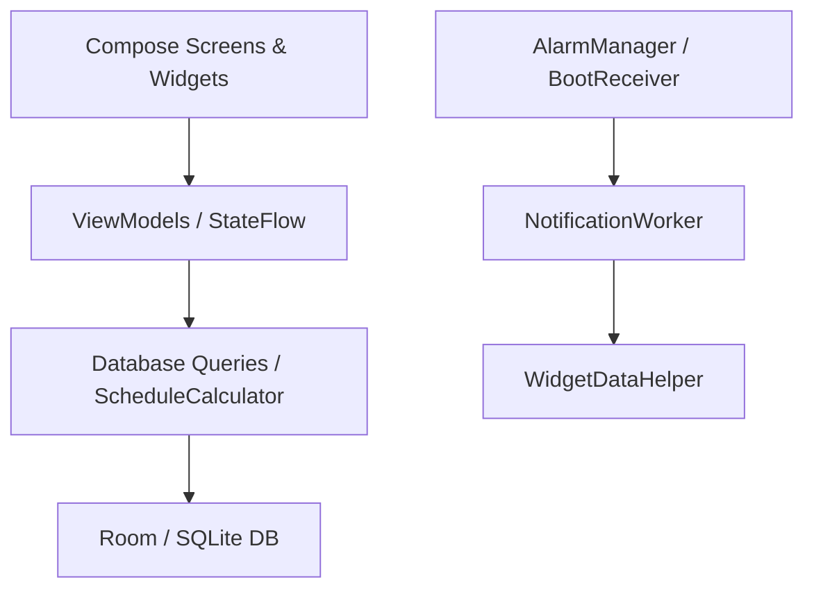

# 📅 ShiftPlanner

[](https://kotlinlang.org/)
[](https://developer.android.com/)
[](https://developer.android.com/jetpack/compose)
[](https://developer.android.com/training/data-storage/room)

An Android app developed in **Kotlin** with **Jetpack Compose** for
shift workers.

ShiftPlanner was developed to address a specific user need and is
designed to help shift workers keep track of **rotating schedules,
overtime, extra shifts, shift swaps, colleagues' working hours, and
reminders**.


---

## 🎯 Project Background

This project was developed in my spare time after completing my education
as a personal Android project with a practical use case.

The purpose of the project was to develop a practical scheduling app for
a relative who works shifts. The starting point was a real need to keep
track of work shifts, rotating schedules, overtime, shift swaps, and
reminders in a single application.

The project has primarily served as a way to continue developing my
skills in Android development and Kotlin after completing my education.

During development, I have worked extensively with:

- Android development with Kotlin and Jetpack Compose.
- Local data storage with Room and SQLite.
- Reactive state management with Flow and StateFlow.
- Background processing with WorkManager and AlarmManager.
- Android BroadcastReceiver and handling device reboots.
- Home screen widgets with Jetpack Glance.
- Notifications and scheduled reminders.
- Developing an app based on a concrete user need.


---

## 📑 Table of Contents

- [Project Background](#-project-background)
- [Project Structure](#-project-structure)
- [Folder Structure](#-folder-structure)
- [Getting Started](#-getting-started)
- [Screenshots](#️-screenshots)
- [Features](#-features)
- [Architecture](#️-architecture)
- [Kotlin/Android Concepts](#-kotlinandroid-concepts)
- [Important Files](#-important-files)
- [License](#-license)
- [AI Assistance and Code Generation](#-ai-assistance-and-code-generation)


---

## 📁 Project Structure

The project consists of an Android app where the UI, ViewModels, database, and background functionality are separated into distinct components.

| Component | Type | Description |
|:---|:---|:---|
| `ShiftPlanner` | Gradle Root | The project root and Gradle configuration. |
| `app` | Android Application | Contains the app's UI, ViewModels, database, widgets, and alarms. |


---

## 🧱 Folder Structure

The core logic of the app is located under:

```text
app/src/main/java/com/example/shiftplanner/
├── alarm/                  # AlarmManager, BroadcastReceivers & NotificationWorker
├── data/
│   └── db/                 # Room: Entities, DAO & AppDatabase
├── model/                  # Data models and shift types
├── ui/
│   ├── screens/            # Compose screens
│   └── theme/              # Material 3: Color, Type & Theme
├── utils/                  # Helper classes for calculations and UI logic
└── widget/                 # Jetpack Glance / App Widget implementation
```

---

## 🚀 Getting Started

### Prerequisites

- Android Studio
- Kotlin
- Gradle
- Android SDK
- An Android device or emulator

### Build & Run

1. Clone the repository:

```bash
git clone <REPOSITORY_URL>
```

2. Open the project in **Android Studio**.

3. Sync the Gradle files.

4. Select an Android device or emulator.

5. Run the project from Android Studio.

You can also build a debug version from the terminal:

```bash
./gradlew assembleDebug
```

> **Note:** Replace `<REPOSITORY_URL>` with the URL of the GitHub repository.

---

### 🎬 Demo

<div align="center">
  <video src="https://github.com/user-attachments/assets/6e0548da-7d18-4f0c-bce7-15d08b335a82" autoplay loop muted playsinline width="250"></video>
</div>

---

## 🖼️ Screenshots

A few examples from the app's interface:

| Home Screen (Today) | Month View | Manage Shifts |
|:---:|:---:|:---:|
|  |  |  |
| *Today's shifts and<br>colleagues' working hours* | *Monthly calendar<br>with Pager* | *Manage extra shifts and<br>shift swaps* |

| Schedule Overview | Statistics | Home Screen Widget |
|:---:|:---:|:---:|
|  |  |  |
| *Rotating<br>6-week schedule* | *Overview and<br>search* | *Home screen widget<br>(Jetpack Glance)* |

---

## ✨ Features

| Feature | Description |
|:---|:---|
| **Today** | Displays today's shifts, times, and which colleagues are working. |
| **Month View** | Browse between months and select a year or month directly. Past days are shown with a greyed-out appearance. |
| **Extra Shifts & Shift Swaps** | Manage overtime and shift swaps. The app checks for issues such as double bookings. |
| **Home Screen Widget** | Displays the weekly schedule and today's shifts directly on the Android home screen. |
| **Evening Reminders** | Sends a reminder the evening before a work shift. |
| **Reboot Protection** | `BootReceiver` reschedules alarms after the phone has been restarted. |
| **Color-Coded Shifts** | Different colors are used to make the schedule easier to scan. |

---

## 🏗️ Architecture

ShiftPlanner uses **MVVM**, keeping the UI, state, data layer, and background processing separated.



### Architecture Flow

```text
Compose UI
    ↓
ViewModel / StateFlow
    ↓
ScheduleCalculator / DAO
    ↓
Room Database
    ↓
SQLite
```

Background notifications are handled separately:

```text
AlarmManager / BootReceiver
    ↓
NotificationWorker
    ↓
Notification
    ↓
WidgetDataHelper
```

### MVVM

The UI is built with Jetpack Compose and uses ViewModels to manage state and handle logic between the UI and data layer.

`StateFlow` is used to send updates from ViewModels to Compose screens.

### Room

Room is used as a layer on top of the SQLite database. The database contains information about schedules, colleagues, overtime, and shift swaps.

### Background Processing

`AlarmManager`, `BroadcastReceiver`, and `WorkManager` are used for functionality that needs to continue working even when the app is not open.

---

## 🧠 Kotlin/Android Concepts

| Area | Example in Code | Explanation |
|:---|:---|:---|
| **Kotlin Flows & Coroutines** | `Flow`, `StateFlow`, `collectAsState` | Used to send data from the database to the UI and handle asynchronous operations. |
| **Background Processing** | `BroadcastReceiver`, `CoroutineWorker` | Handles tasks such as device reboots and background jobs. |
| **Exact Alarms** | `AlarmManager.setExactAndAllowWhileIdle` | Used for evening reminders even when the phone is in power-saving mode. |
| **Room Database** | `@Entity`, `@Dao`, Relations / Joins | Used for local storage of schedules, colleagues, and overtime. |
| **Jetpack Compose** | `Card`, `HorizontalPager`, `FilterChip` | Used for the app's UI and interactions. |
| **Jetpack Glance** | App Widget | Used to display the schedule as a home screen widget. |

---

## 📚 Important Files

### Database

- `data/db/AppDatabase.kt`  
  Configuration of the Room database.

- `data/db/ScheduleDao.kt`  
  SQL queries and `Flow`-based data flows for schedules and colleagues.

- `data/db/OvertimeEntry.kt`  
  Entity for overtime, absence, and shift swaps.

### Alarms & Notifications

- `alarm/AlarmHelper.kt`  
  Creates and cancels alarms.

- `alarm/NotificationWorker.kt`  
  WorkManager job that checks the next day's shifts and sends reminders.

- `alarm/BootReceiver.kt`  
  Runs after a device reboot and reschedules the alarms.

### UI

- `ui/screens/HomeScreen.kt`  
  Main screen with today's shifts, weekly row, and quick actions.

- `ui/screens/MonthViewScreen.kt`  
  Monthly calendar with Pager and options for managing the schedule.

---

## 📜 License

This project is distributed under the **MIT License**.

```text
MIT License

Copyright (c) 2026 VictorKoffed

Permission is hereby granted, free of charge, to any person obtaining a copy
of this software and associated documentation files (the "Software"), to deal
in the Software without restriction, including without limitation the rights
to use, copy, modify, merge, publish, distribute, sublicense, and/or sell
copies of the Software, and to permit persons to whom the Software is
furnished to do so, subject to the following conditions:

The above copyright notice and this permission notice shall be included in all
copies or substantial portions of the Software.

THE SOFTWARE IS PROVIDED "AS IS", WITHOUT WARRANTY OF ANY KIND, EXPRESS OR
IMPLIED, INCLUDING BUT NOT LIMITED TO THE WARRANTIES OF MERCHANTABILITY,
FITNESS FOR A PARTICULAR PURPOSE AND NONINFRINGEMENT. IN NO EVENT SHALL THE
AUTHORS OR COPYRIGHT HOLDERS BE LIABLE FOR ANY CLAIM, DAMAGES OR OTHER
LIABILITY, WHETHER IN AN ACTION OF CONTRACT, TORT OR OTHERWISE, ARISING FROM,
OUT OF OR IN CONNECTION WITH THE SOFTWARE OR THE USE OR OTHER DEALINGS IN THE
SOFTWARE.
```

---

## 🤖 AI Assistance and Code Generation

AI was used as a development aid during the project.

### Tools Used

- **Gemini** – assistance with structure, debugging, code, and documentation.

### How AI Was Used

AI was used for:

- Implementation suggestions.
- Debugging Kotlin and Android code.
- Structuring certain parts of the project.
- Assistance with Room, Compose, and Android components.
- Documentation.

### Human Review

Code produced with the help of AI was manually reviewed and tested before being used in the project.

The final implementation and decisions regarding the project's structure and functionality were made by the developer.

--- 
