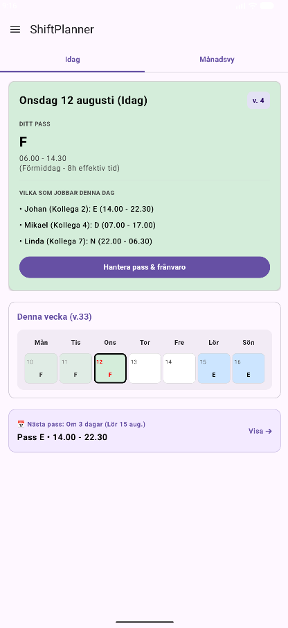
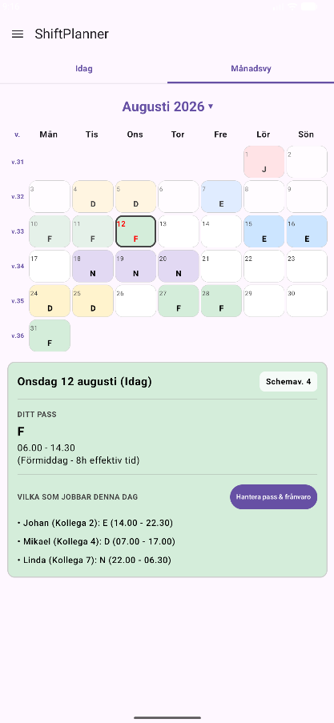
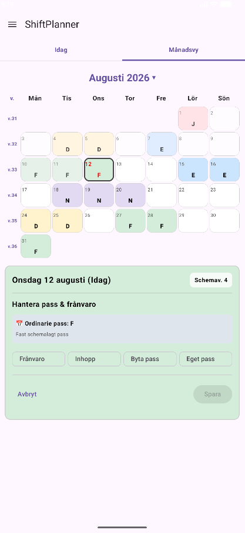
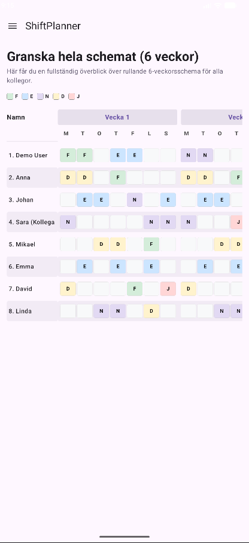
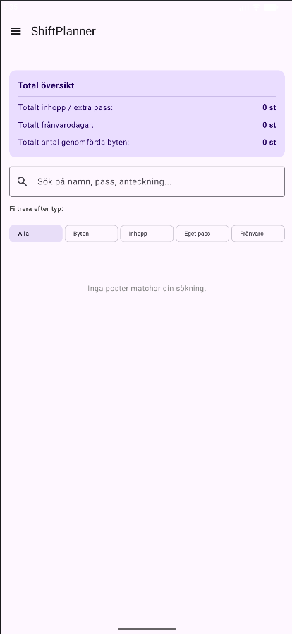
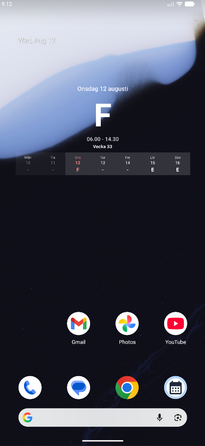
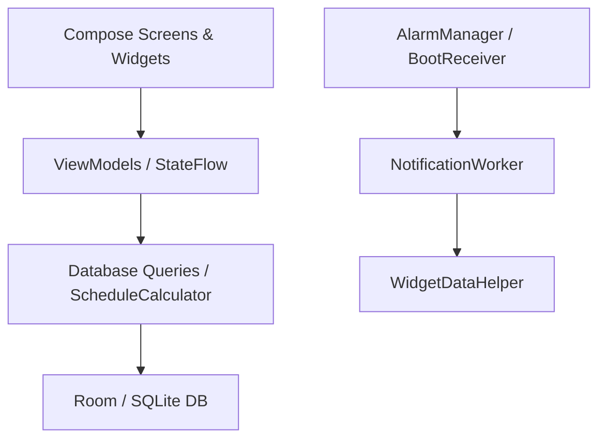

# 📅 ShiftPlanner

[](https://kotlinlang.org/)
[](https://developer.android.com/)
[](https://developer.android.com/jetpack/compose)
[](https://developer.android.com/training/data-storage/room)

En Android-app utvecklad i **Kotlin** med **Jetpack Compose** för
skiftarbetare.

ShiftPlanner är utvecklad utifrån ett konkret användarbehov och är
avsedd att hjälpa skiftarbetare att hålla ordning på **rullande
scheman, övertid, inhopp, passbyten, kollegors arbetstider och
påminnelser**.


---

## 🎯 Projektbakgrund

Detta projekt utvecklades på fritiden efter avslutad utbildning som ett
eget Android-projekt med ett konkret användningsområde.

Syftet med projektet var att utveckla en praktisk schemaapp för en
släkting som arbetar skift. Utgångspunkten var ett verkligt behov av att
kunna hålla ordning på arbetspass, rullande scheman, övertid,
passbyten och påminnelser i en och samma applikation.

Projektet har framför allt fungerat som ett sätt att fortsätta utveckla
kunskaper inom Android-utveckling och Kotlin efter avslutad
utbildning.

Under utvecklingen har jag bland annat fördjupat mig inom:

- Android-utveckling med Kotlin och Jetpack Compose.
- Lokal datalagring med Room och SQLite.
- Reaktiv state-hantering med Flow och StateFlow.
- Bakgrundsarbete med WorkManager och AlarmManager.
- Android BroadcastReceiver och hantering av enhetsomstarter.
- Hemskärmswidgets med Jetpack Glance.
- Notiser och schemalagda påminnelser.
- Utveckling av en app utifrån ett konkret användarbehov.


---

## 📑 Innehåll

- [Projektbakgrund](#-projektbakgrund)
- [Projektstruktur](#-projektstruktur)
- [Mappstruktur](#-mappstruktur)
- [Kom igång](#-kom-igång)
- [Skärmbilder](#️-skärmbilder)
- [Funktioner](#-funktioner)
- [Arkitektur](#️-arkitektur)
- [Kotlin/Android-koncept](#-kotlinandroid-koncept)
- [Katalog över viktiga filer](#-katalog-över-viktiga-filer)
- [License](#-license)
- [AI-assistans och kodgenerering](#-ai-assistans-och-kodgenerering)


---

## 📁 Projektstruktur

Projektet består av en Android-app där UI, ViewModels, databas och bakgrundsfunktioner är uppdelade i separata delar.

| Del | Typ | Beskrivning |
|:---|:---|:---|
| `ShiftPlanner` | Gradle Root | Projektets huvudnivå och Gradle-konfiguration. |
| `app` | Android Application | Innehåller appens UI, ViewModels, databas, widgets och larm. |


---

## 🧱 Mappstruktur

Kärnlogiken för appen finns under:

```text
app/src/main/java/com/example/shiftplanner/
├── alarm/                  # AlarmManager, BroadcastReceivers & NotificationWorker
├── data/
│   └── db/                 # Room: Entities, DAO & AppDatabase
├── model/                  # Datamodeller och skift-typer
├── ui/
│   ├── screens/            # Compose-skärmar
│   └── theme/              # Material 3: Color, Type & Theme
├── utils/                  # Hjälpklasser för beräkningar och UI-logik
└── widget/                 # Jetpack Glance / App Widget-implementation
```

---

## 🚀 Kom igång

### Förutsättningar

- Android Studio
- Kotlin
- Gradle
- Android SDK
- En Android-enhet eller emulator

### Build & Run

1. Klona repot:

```bash
git clone <REPOSITORY_URL>
```

2. Öppna projektet i **Android Studio**.

3. Synkronisera Gradle-filerna.

4. Välj en Android-enhet eller emulator.

5. Kör projektet från Android Studio.

Det går även att bygga en debug-version från terminalen:

```bash
./gradlew assembleDebug
```

> **Obs:** Ersätt `<REPOSITORY_URL>` med URL:en till GitHub-repositoriet.

---

### 🎬 Demo

<div align="center">
  <video src="https://github.com/user-attachments/assets/6e0548da-7d18-4f0c-bce7-15d08b335a82" autoplay loop muted playsinline width="250"></video>
</div>

---

## 🖼️ Skärmbilder

Några exempel från appens gränssnitt:

| Startskärm (Idag) | Månadsvy | Hantera pass |
|:---:|:---:|:---:|
|  |  |  |
| *Dagens pass och<br>kollegors tider* | *Månadskalender<br>med Pager* | *Hantera inhopp och<br>passbyten* |

| Schemat översikt | Statistik | Hemskärmswidget |
|:---:|:---:|:---:|
|  |  |  |
| *Rullande<br>6-veckorsschema* | *Översikt och<br>sökning* | *Hemskärmswidget<br>(Jetpack Glance)* |

---

## ✨ Funktioner

| Funktion | Beskrivning |
|:---|:---|
| **Idag** | Visar dagens pass, tider och vilka kollegor som arbetar. |
| **Månadsvy** | Bläddra mellan månader och välj år eller månad direkt. Passerade dagar visas med gråtoning. |
| **Inhopp & passbyten** | Hantera övertid och passbyten. Appen kontrollerar bland annat dubbelbokningar. |
| **Hemskärmswidget** | Visar veckoschemat och dagens pass direkt på Android-startskärmen. |
| **Kvällspåminnelser** | Skickar en påminnelse kvällen innan ett arbetspass. |
| **Omstartsskydd** | `BootReceiver` schemalägger om larm efter att telefonen har startats om. |
| **Färgkodade pass** | Olika färger används för att göra schemat lättare att överblicka. |

---

## 🏗️ Arkitektur

ShiftPlanner använder **MVVM** där UI, state, datalager och bakgrundsarbete hålls separerade.



### Arkitekturflöde

```text
Compose UI
    ↓
ViewModel / StateFlow
    ↓
ScheduleCalculator / DAO
    ↓
Room Database
    ↓
SQLite
```

Bakgrundsnotiser hanteras separat:

```text
AlarmManager / BootReceiver
    ↓
NotificationWorker
    ↓
Notification
    ↓
WidgetDataHelper
```

### MVVM

UI:t är byggt med Jetpack Compose och använder ViewModels för att hålla reda på state och hantera logik mellan UI och datalagret.

`StateFlow` används för att skicka uppdateringar från ViewModels till Compose-skärmarna.

### Room

Room används som ett lager ovanpå SQLite-databasen. Databasen innehåller bland annat information om scheman, kollegor, övertid och passbyten.

### Bakgrundsarbete

`AlarmManager`, `BroadcastReceiver` och `WorkManager` används för funktioner som ska fortsätta fungera även när appen inte är öppen.

---

## 🧠 Kotlin/Android-koncept

| Område | Exempel i koden | Förklaring |
|:---|:---|:---|
| **Kotlin Flows & Coroutines** | `Flow`, `StateFlow`, `collectAsState` | Används för att skicka data från databasen till UI:t och hantera asynkrona operationer. |
| **Bakgrundsarbete** | `BroadcastReceiver`, `CoroutineWorker` | Hanterar bland annat omstarter av enheten och bakgrundsjobb. |
| **Exakta larm** | `AlarmManager.setExactAndAllowWhileIdle` | Används för kvällspåminnelser även när telefonen är i strömsparläge. |
| **Room Database** | `@Entity`, `@Dao`, Relations / Joins | Används för lokal lagring av scheman, kollegor och övertid. |
| **Jetpack Compose** | `Card`, `HorizontalPager`, `FilterChip` | Används för appens gränssnitt och interaktion. |
| **Jetpack Glance** | App Widget | Används för att visa schemat som en widget på hemskärmen. |

---

## 📚 Katalog över viktiga filer

### Databas

- `data/db/AppDatabase.kt`  
  Konfiguration av Room-databasen.

- `data/db/ScheduleDao.kt`  
  SQL-frågor och `Flow`-baserade dataflöden för scheman och kollegor.

- `data/db/OvertimeEntry.kt`  
  Entitet för övertid, frånvaro och passbyten.

### Larm & notiser

- `alarm/AlarmHelper.kt`  
  Skapar och avbryter larm.

- `alarm/NotificationWorker.kt`  
  WorkManager-jobb som kontrollerar morgondagens pass och skickar påminnelser.

- `alarm/BootReceiver.kt`  
  Körs efter omstart av enheten och schemalägger om larmen.

### UI

- `ui/screens/HomeScreen.kt`  
  Huvudskärmen med dagens pass, veckorad och snabbval.

- `ui/screens/MonthViewScreen.kt`  
  Månadskalender med Pager och möjlighet att hantera schemat.

---

## 📜 License

Detta projekt distribueras under **MIT License**.

```text
MIT License

Copyright (c) 2026 ShiftPlanner

Permission is hereby granted, free of charge, to any person obtaining a copy
of this software and associated documentation files (the "Software"), to deal
in the Software without restriction, including without limitation the rights
to use, copy, modify, merge, publish, distribute, sublicense, and/or sell
copies of the Software, and to permit persons to whom the Software is
furnished to do so, subject to the following conditions:

The above copyright notice and this permission notice shall be included in all
copies or substantial portions of the Software.

THE SOFTWARE IS PROVIDED "AS IS", WITHOUT WARRANTY OF ANY KIND, EXPRESS OR
IMPLIED, INCLUDING BUT NOT LIMITED TO THE WARRANTIES OF MERCHANTABILITY,
FITNESS FOR A PARTICULAR PURPOSE AND NONINFRINGEMENT. IN NO EVENT SHALL THE
AUTHORS OR COPYRIGHT HOLDERS BE LIABLE FOR ANY CLAIM, DAMAGES OR OTHER
LIABILITY, WHETHER IN AN ACTION OF CONTRACT, TORT OR OTHERWISE, ARISING FROM,
OUT OF OR IN CONNECTION WITH THE SOFTWARE OR THE USE OR OTHER DEALINGS IN THE
SOFTWARE.
```

---

## 🤖 AI-assistans och kodgenerering

AI har använts som stöd under utvecklingen av projektet.

### Verktyg som använts

- **Gemini** – hjälp med struktur, felsökning, kod och dokumentation.

### Hur AI användes

AI användes bland annat för:

- Förslag på implementationer.
- Felsökning av Kotlin- och Android-kod.
- Strukturering av vissa delar av projektet.
- Hjälp med Room, Compose och Android-komponenter.
- Dokumentation.

### Mänsklig granskning

Kod som tagits fram med hjälp av AI har granskats och testats manuellt innan den använts i projektet.

Den slutliga implementationen och beslut kring projektets struktur och funktionalitet har gjorts av utvecklaren.

---
